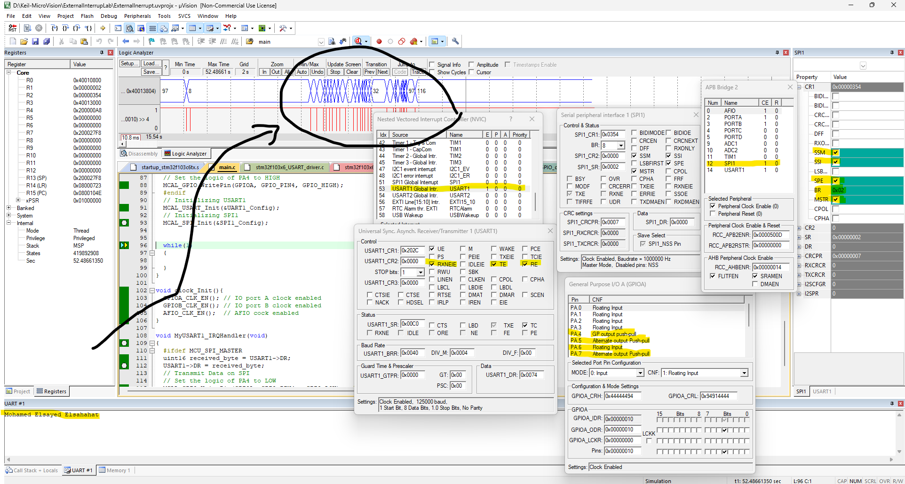
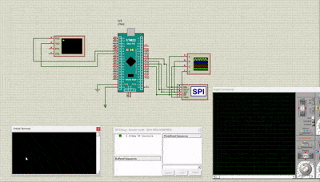
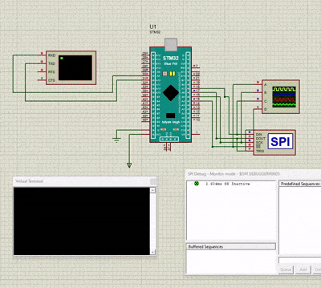

# STM32 SPI Driver Project

This project implements an SPI (Serial Peripheral Interface) driver for the STM32F103 microcontroller using the CMSIS library. The driver supports both **master** and **slave** modes, USART communication, and GPIO configurations. It includes a complete example for initializing and transmitting/receiving data via SPI and USART.

## **Features**
- Supports SPI master and slave modes.
- Customizable SPI configurations including:
  - Clock polarity and phase (CPOL/CPHA).
  - Baud rate control.
  - Data frame format (MSB/LSB first).
  - Data size (8-bit or 16-bit).
  - Software slave management (SSM) and hardware NSS pin.
- USART configuration with interrupt handling.
- GPIO configuration for SPI chip select.
- Flexible and modular architecture for easy reuse and adaptation.

## **Getting Started**

### **Hardware Requirements**
- STM32F103C8T6 (Blue Pill) development board.
- USB-to-Serial module for USART communication.
- External components:
  - SPI peripherals (e.g., sensors, displays).
  - Logic analyzer (optional for debugging).

### **Software Requirements**
- **Keil Microvision** for building and debugging the firmware.
- **Proteus Design Suite** for circuit simulation.

---

## **Configuration**

### **Main.c**
- Use `#define MCU_SPI_MASTER` to enable SPI master mode.
- Use `#define MCU_SPI_SLAVE` to enable SPI slave mode.
- Customize the SPI and USART configuration in `SPI1_Config` and `UART1_Config`.

### **SPI Configuration Options**
These can be found in the `SPI_Config_t` structure:
- Clock polarity: `SPI_CPOL_HIGH`, `SPI_CPOL_LOW`.
- Clock phase: `SPI_CPHA_FIRST_EDGE`, `SPI_CPHA_SECOND_EDGE`.
- Baud rate: `SPI_BAUDRATE_FPCLK_DIV_8`, etc.
- Data frame format: `SPI_DFF_MSB_FIRST`, `SPI_DFF_LSB_FIRST`.

---

## **Keil Microvision Debugging**

---

## **Proteus Debugging**

---

## **Proteus Simulation Video**
A video demonstrating the Proteus simulation of the SPI project is provided below:

---

## **Author**
- **Mohamed Elsayed**

