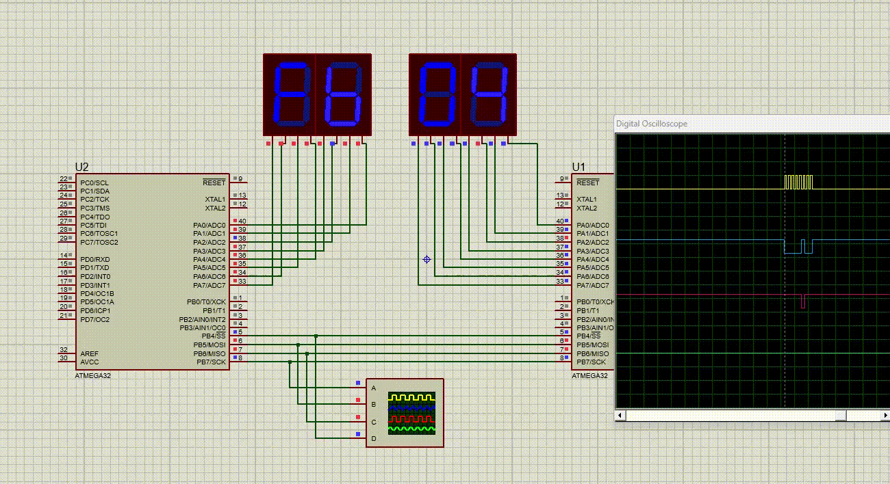

# SPI Communication Between Two ATmega32 MCUs

This project demonstrates SPI communication between two ATmega32 microcontrollers, where one operates as the **Master** and the other as the **Slave**. The Master sends data to the Slave, which processes the data and sends it back. The received data is displayed on `PORTA` of both MCUs, which can be connected to LEDs or a 7-segment display.

---

## **Features**
- **Full-Duplex SPI Communication**: Both MCUs transmit and receive data simultaneously.
- **Master-Slave Setup**: The Master controls the communication, while the Slave responds to the Master's data.
- **Data Processing**: The Slave increments the received data before sending it back to the Master.
- **Visual Feedback**: The transmitted and received data are displayed on `PORTA`.

---

## **Hardware Requirements**
1. Two ATmega32 MCUs.
2. Common GND connection between both MCUs.
3. Connections for SPI pins:
   - **MOSI → MOSI**
   - **MISO → MISO**
   - **SCK → SCK**
   - **SS → SS**
4. LEDs or a 7-segment display connected to `PORTA` of both MCUs for data visualization.

---

## **Connections**
| Master Pin | Slave Pin |
|------------|-----------|
| MOSI (PB5) | MOSI (PB5) |
| MISO (PB6) | MISO (PB6) |
| SCK  (PB7) | SCK  (PB7) |
| SS   (PB4) | SS   (PB4) |
| GND        | GND        |

---

## **Software**
- **Master Code**: Sends data from `0x00` to `0xFF` and receives a response from the Slave. The received data is displayed on `PORTA`.
- **Slave Code**: Receives data from the Master, increments it by 1, and sends it back. The processed data is also displayed on `PORTA`.

---

## **Compilation and Upload**
1. Use **Atmel Studio** or any AVR toolchain to compile the Master and Slave codes.
2. Flash the Master code to one ATmega32 MCU.
3. Flash the Slave code to the other ATmega32 MCU.

---

## **Expected Behavior**
- The Master sends incrementing data (e.g., `0x00`, `0x01`, `0x02`).
- The Slave increments the received data (e.g., `0x00` → `0x01`, `0x01` → `0x02`) and sends it back.
- Both MCUs display the respective data on their `PORTA`.

