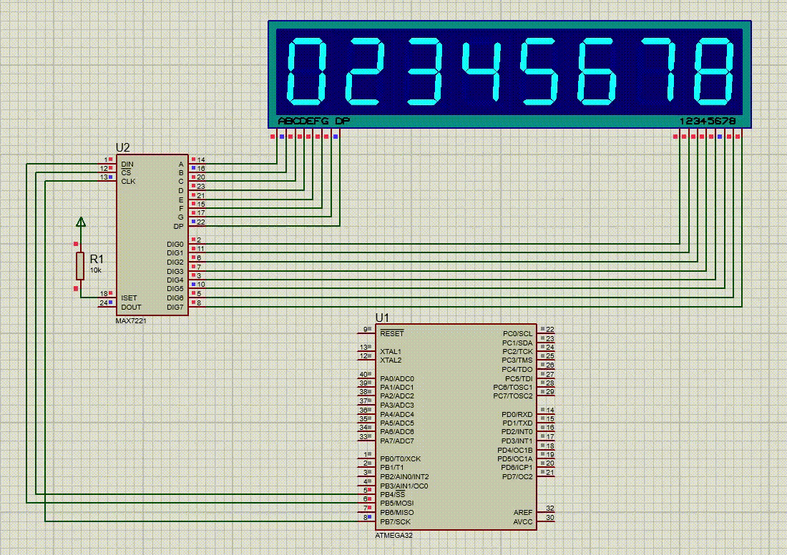

# MAX7219 7-Segment Display Controller

This project demonstrates controlling a MAX7219 8-digit 7-segment display using an AVR microcontroller (ATmega series) via SPI. The code initializes the MAX7219 and sequentially displays values across the 8 digits.

## Features
- Initializes the MAX7219 to operate in a mode with all 8 digits connected.
- Displays numbers on the 7-segment display in a sequential manner.
- Includes a test function to blink all segments in sequence.

## Hardware Requirements
- **MAX7219 8-digit 7-segment display**
- **AVR microcontroller** (e.g., ATmega328P)
- **Connections**:
  - **SS (Chip Select)**: PB4
  - **MOSI (Master Out Slave In)**: PB5
  - **SCK (Serial Clock)**: PB7

## Software Requirements
- AVR-GCC or another compatible compiler for AVR microcontrollers.
- The `util/delay.h` library for timing delays.

## Pin Configuration
- **SS (PB4)**: Chip Select
- **MOSI (PB5)**: Master Out Slave In
- **SCK (PB7)**: Serial Clock

## Code Overview
1. **SPI Initialization**: Sets up the SPI interface to communicate with the MAX7219.
2. **MAX7219_Write**: Sends data to the MAX7219.
3. **MAX7219_Init**: Initializes the MAX7219 to configure brightness, scan mode, and disable test mode.
4. **TestAllSegments**: Blinks all the segments on the display.
5. **DisplayDigit**: Displays a specific value on a given digit.

## How to Use
1. Connect the MAX7219 to the AVR microcontroller, ensuring that the connections for **SS**, **MOSI**, and **SCK** are correctly mapped.
2. Upload the code to your AVR microcontroller.
3. The display will show numbers from 1 to 8 in sequence, with all segments flashing in between.

