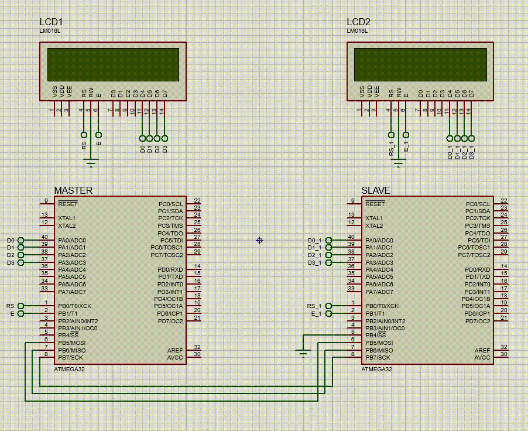

# SPI Communication Project - Master and Slave

This repository demonstrates the implementation of SPI communication between a master and a slave using two AVR microcontrollers (ATmega32). The master and slave both communicate by transmitting and receiving characters, displaying the transmitted and received data on an LCD screen.

## Components

- **ATmega32 microcontroller** (Master and Slave)
- **LCD** for displaying transmitted and received data
- **SPI** (Serial Peripheral Interface) protocol for communication

## Features

- **Master Mode**: The master device transmits characters sequentially from 'A' to 'Z' and receives data from the slave.
- **Slave Mode**: The slave device receives the character sent by the master, displays it on the LCD, and then sends back a character that is decremented from 'Z' to 'A'.
- **LCD Display**: Both devices display the transmitted and received data on an LCD.

## File Overview

- **master.c**: SPI communication for the master device.
- **slave.c**: SPI communication for the slave device.
- **atmega32_GPIO_driver.h**: GPIO configuration and helper functions.
- **atmega32_HAL_LCD.h**: LCD initialization and functions for displaying data.
- **atmega32_UART_driver.h**: UART functions for debugging and serial communication.

## Setup

### Hardware Connections

1. Connect the **MOSI** pin of the master to the **MISO** pin of the slave.
2. Connect the **MISO** pin of the master to the **MOSI** pin of the slave.
3. Connect the **SCK** pin between both master and slave.
4. Ensure the **SS** (Slave Select) pin is controlled by the master in master mode.

