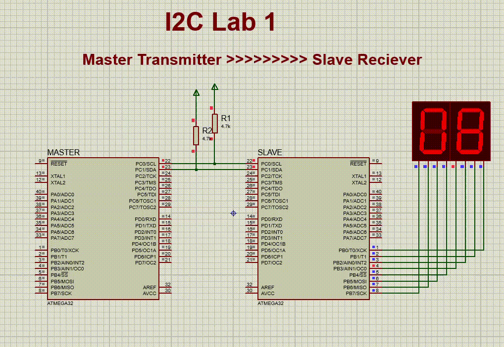

### **I2C Communication Between Master and Slave on ATmega32**

This repository contains a fully functional implementation of I2C communication for the ATmega32 microcontroller, featuring both Master and Slave modes. It demonstrates how to send and display numbers (1–99) using two 7-segment displays connected to the Slave device.

---

