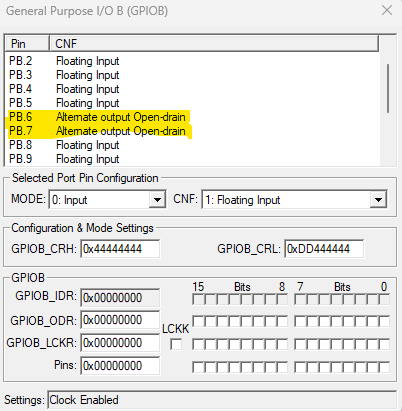
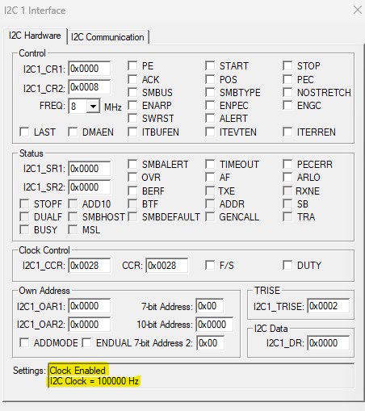
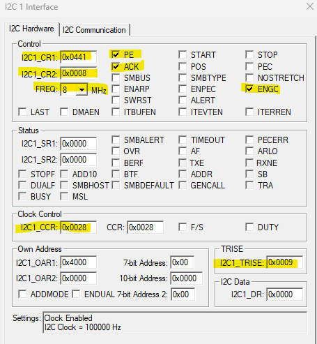
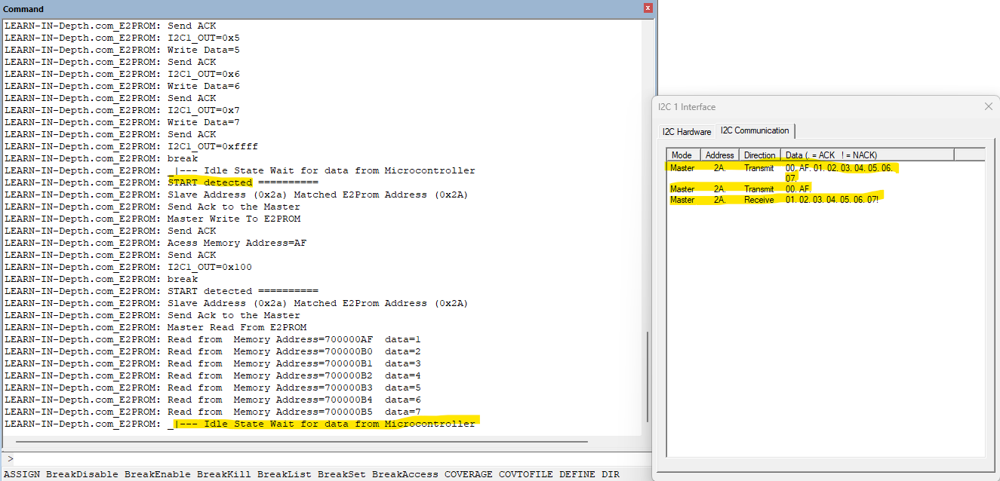
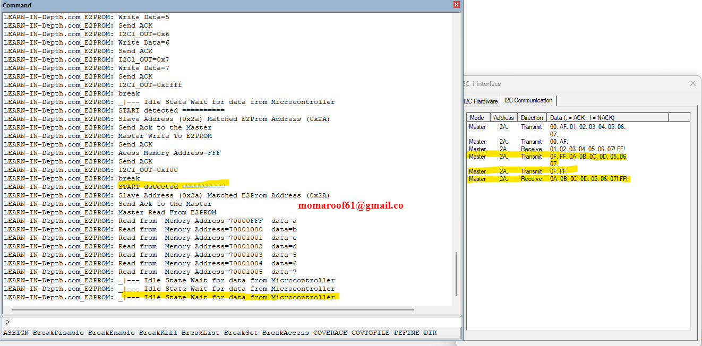

# **STM32 I2C Driver and EEPROM Slave Device Driver**

This repository contains an I2C driver and an EEPROM slave device driver for the STM32 microcontroller. The application demonstrates writing and reading data to/from an external EEPROM using the I2C protocol. The project is developed using Keil µVision and tested on an STM32F103C6 microcontroller.

---

## **Table of Contents**
1. [Project Overview](#project-overview)
2. [Hardware Setup](#hardware-setup)
3. [Software Setup](#software-setup)
4. [Debugging with Keil µVision](#debugging-with-keil-µvision)
5. [Test Cases](#test-cases)
6. [Simulation Video](#simulation-video)
7. [Screenshots](#screenshots)
8. [License](#license)

---

## **Project Overview**
The project demonstrates communication between an STM32 microcontroller and an external EEPROM using the I2C protocol. The following features are implemented:
- **I2C Driver**: Handles I2C initialization, data transmission, and reception.
- **EEPROM Driver**: Provides functions to write and read data to/from the EEPROM.
- **Application**: Tests the I2C and EEPROM drivers by writing and reading data from specific memory addresses.

---

## **Hardware Setup**
- **Microcontroller**: STM32F103C6
- **EEPROM**: 24LC256 (or any I2C-compatible EEPROM)
- **Connections**:
  - **SCL**: PB6 (I2C1_SCL)
  - **SDA**: PB7 (I2C1_SDA)
  - **VCC**: 3.3V
  - **GND**: Common ground

---

## **Software Setup**
1. **Keil µVision**: Install Keil µVision and the STM32F1xx device pack.
2. **STM32CubeMX**: Generate initialization code for GPIO and I2C peripherals (optional).
3. **Project Files**:
   - `main.c`: Application code.
   - `stm32f103x6_i2c_driver.c`: I2C driver implementation.
   - `stm32f103x6_i2c_driver.h`: I2C driver header file.
   - `eeprom_slave_driver.c`: EEPROM driver implementation.
   - `eeprom_slave_driver.h`: EEPROM driver header file.

---

## **Debugging with Keil µVision**
1. Open the project in Keil µVision.
2. Build the project (`Project > Build Target`).
3. Connect your STM32 microcontroller to the debugger (e.g., ST-Link).
4. Start debugging (`Debug > Start/Stop Debug Session`).
5. Use the following debugging tools:
   - **Watch Window**: Monitor variables like `ch1`, `ch2`, and `memoryAddress`.
   - **Memory Window**: Inspect EEPROM memory locations.
   - **Serial Wire Viewer (SWV)**: Trace I2C communication in real-time.

---

## **Test Cases**
### **Test Case 1**
- **Write Data**: Write `{0x1, 0x2, 0x3, 0x4, 0x5, 0x6, 0x7}` to memory address `0xAF`.
- **Read Data**: Read 7 bytes from memory address `0xAF` and store in `ch2`.

### **Test Case 2**
- **Write Data**: Write `{0xA, 0xB, 0xC, 0xD, 0x5, 0x6, 0x7}` to memory address `0xFFF`.
- **Read Data**: Read 7 bytes from memory address `0xFFF` and store in `ch2`.

---

## **Simulation Video**
A simulation video demonstrating the I2C communication and EEPROM read/write operations is available here:  
[Simulation Video Link](https://drive.google.com/drive/u/0/folders/1VbJPk2aeK4lQ54gCjH9UPgVcdOr8o0XB) 

---

## **Screenshots**
### **1. GPIO Pins Configuration**
  
*GPIO pins configured for I2C communication (PB6: SCL, PB7: SDA).*

### **2. Clock Enabled**
  
*Clock configuration for GPIO and I2C peripherals.*

### **3. I2C Initialization**
  
*I2C peripheral initialization with 100 kHz clock speed.*

### **4. Test Case 1 Results**
  
*Data written to and read from memory address `0xAF`.*

### **5. Test Case 2 Results**
  
*Data written to and read from memory address `0xFFF`.*

---

## **How to Contribute**
1. Fork the repository.
2. Create a new branch (`git checkout -b feature/YourFeature`).
3. Commit your changes (`git commit -m 'Add some feature'`).
4. Push to the branch (`git push origin feature/YourFeature`).
5. Open a pull request.

---

## **Contact**
For questions or feedback, please contact:  
**Mohamed Elsayed Elshahatt**  
**Email**: momaroof61@gmail.com
**GitHub**: [GitHub Profile](https://github.com/MohamedElsayedd1)
