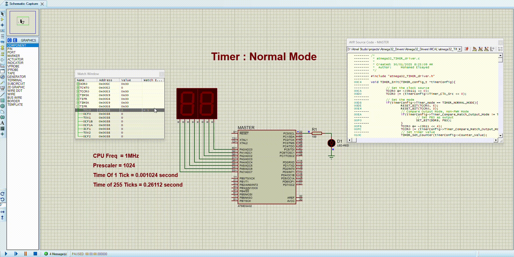
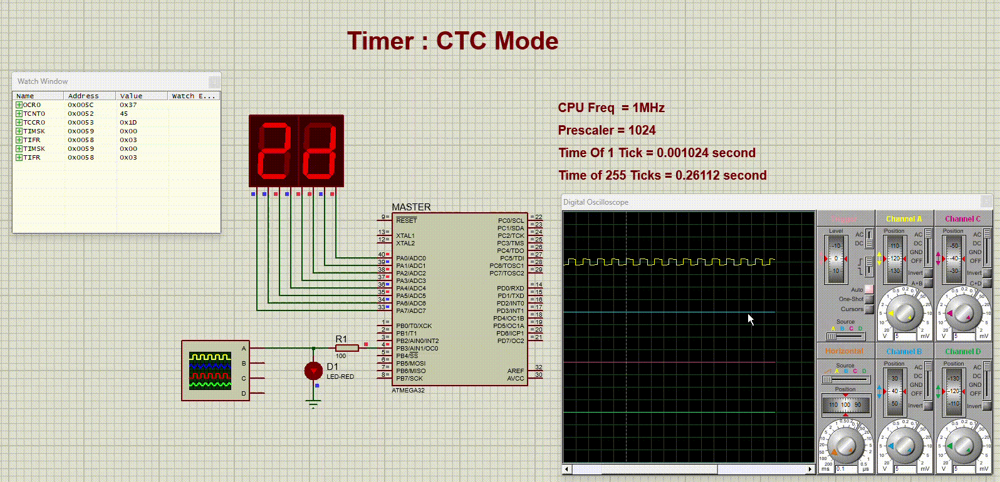
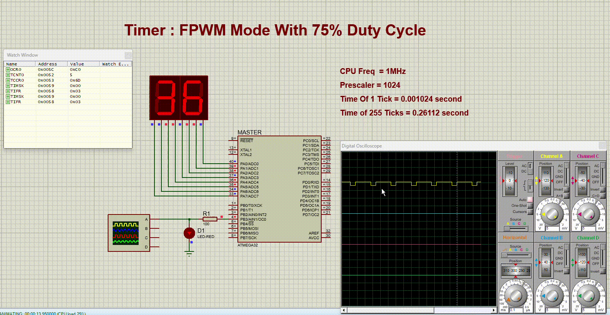
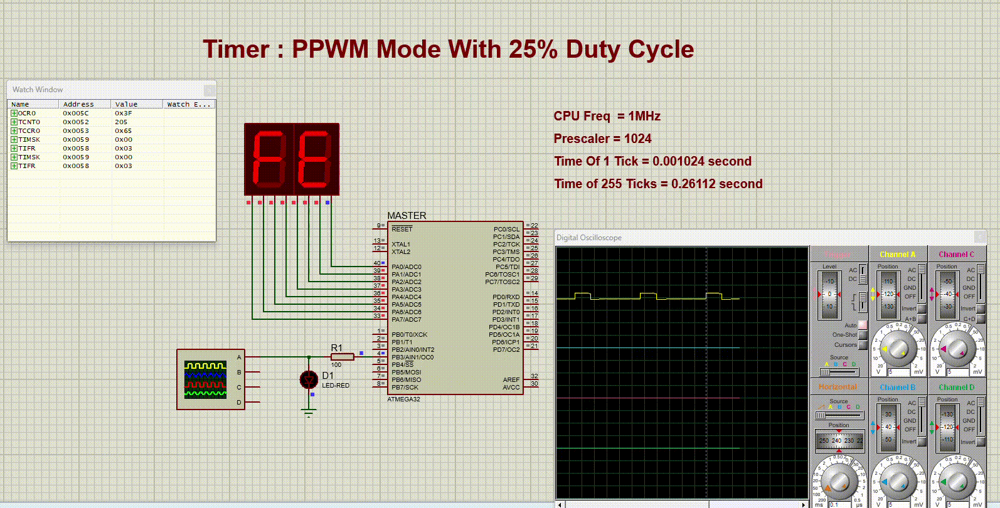
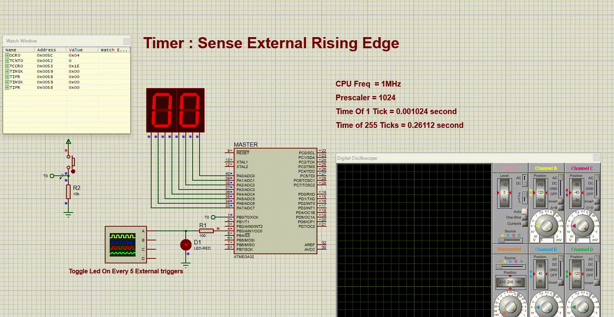

# ATmega32 Timer Modes

## Overview
This project demonstrates different timer modes on the ATmega32 microcontroller using the `atmega32_TIMER_driver` library. The code provides various test cases to showcase normal mode, CTC mode, fast PWM, phase-correct PWM, and external clock timer operation.

## Features
- **Normal Mode**: Timer increments until overflow.
- **CTC Mode**: Timer resets at a specific compare value.
- **Fast PWM**: Generates a high-frequency PWM signal.
- **Phase-Correct PWM**: Generates a symmetrical PWM waveform.
- **External Clock Mode**: Uses an external signal to control the timer.

## Hardware Requirements
- ATmega32 microcontroller
- External clock signal source (for external clock mode test case)
- LEDs or an oscilloscope to observe outputs

## Code Structure
- `main.c`: Contains test cases demonstrating different timer configurations.
- `atmega32_TIMER_driver.h/.c`: Driver files for timer configuration and operations.
- `atmega32_GPIO_driver.h/.c`: GPIO driver for pin configuration.
- `atmega32_HAL_LCD.h/.c`: LCD driver (if used for debugging output).
- `atmega32_UART_driver.h/.c`: UART driver (for serial communication if needed).
- `atmega32_I2C_driver.h/.c`: I2C driver (optional for future enhancements).

## Test Cases
### 1. Normal Mode
- Timer counts from 0 to overflow.
- Observed using `PORTA` to display timer count.

### 2. CTC Mode
- Timer resets at compare value (`Compare_Value = 55`).
- Output toggles at each compare match.

### 3. Fast PWM Mode
- Generates a 75% duty cycle PWM signal.
- Suitable for motor control or LED brightness adjustment.

### 4. Phase-Correct PWM Mode
- Generates a 25% duty cycle symmetrical PWM.
- Ensures smooth control for applications like dimming or speed regulation.

### 5. External Clock Mode
- Timer increments based on external signal input.
- Can be used for event counting or frequency measurement.

## How to Use
1. Flash the firmware onto an ATmega32 microcontroller.
2. Connect LEDs or an oscilloscope to observe timer outputs.
3. Modify test cases as needed and recompile.

## License
This project is released under the MIT License.

## Author
Mohamed Elsayed