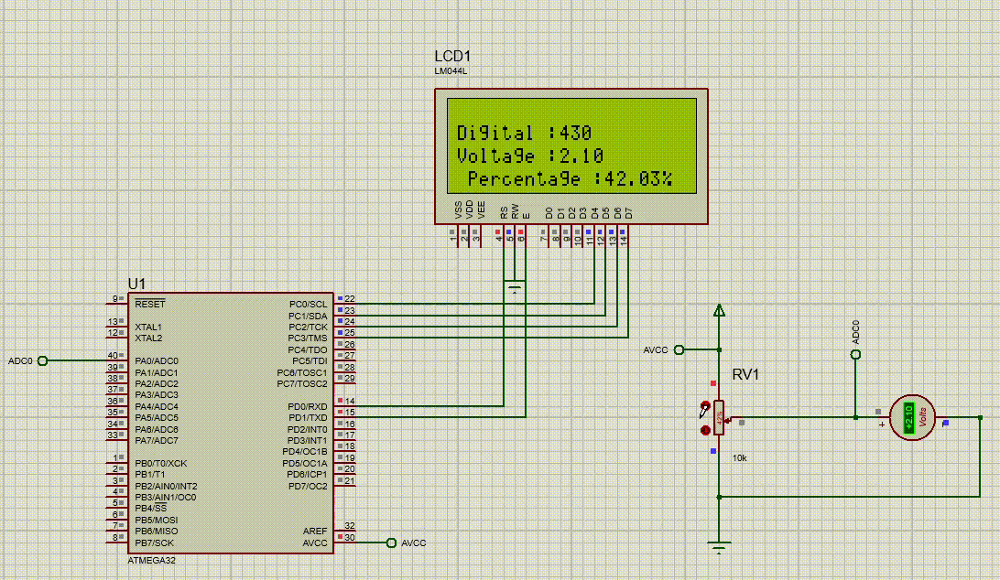

# ATmega32 ADC Display on LCD

## Overview
This project demonstrates how to read an analog voltage using the ATmega32 ADC module and display the digital value, corresponding voltage, and percentage on an LCD.

## Features
- Reads analog input from **ADC Channel 0**.
- Converts the ADC value to a digital representation.
- Displays the digital value, voltage, and percentage on an **LCD**.
- Utilizes a custom integer-to-string conversion function (**my_itoa**).

## Components Used
- **ATmega32 Microcontroller**
- **16x2 LCD Display**
- **Potentiometer (for analog input testing)**
- **ATmega32 ADC Driver**
- **ATmega32 GPIO, LCD, UART, I2C, and TIMER Drivers**

## Simulation

## How to Use
1. **Connect the Potentiometer**
   - Middle pin to **ADC Channel 0**
   - One side to **VCC (5V)**
   - Other side to **GND**
2. **Compile and Upload the Code**
3. **Observe the LCD Output**
   - **Digital ADC Value**
   - **Corresponding Voltage (0-5V)**
   - **Percentage Representation (0-100%)**

## Dependencies
- ATmega32 Standard Libraries
- LCD Driver
- ADC Driver

## Author
**Mohamed Elsayed**

